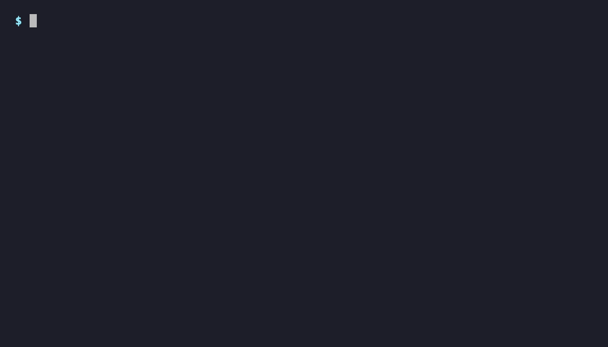

# VS Code + Claude Code in a Docker Sandbox

[](https://docs.docker.com/ai/sandboxes/customize/kits/)
[](https://docs.docker.com/ai/sandboxes/)
[](https://www.anthropic.com/claude-code)
[](LICENSE)

Run **VS Code** with the **Claude Code** extension inside an isolated [Docker Sandbox](https://docs.docker.com/ai/sandboxes/), and open it from your browser or desktop VS Code over a tunnel. Nothing touches your host.



## Quick start

```bash
# 1. Install sbx and sign in  →  https://docs.docker.com/ai/sandboxes/get-started/
sbx login

# 2. Set your Anthropic API key (used for the sandbox's network auth)
export ANTHROPIC_API_KEY=sk-ant-...

# 3. Launch — pulls the kit + image automatically, no clone needed
sbx run claude-vscode . --kit docker.io/ajeetraina777/sbx-vscode-kit:latest
```

Then:

1. Open the **https://github.com/login/device** link it prints and enter the code.
2. Open the **`https://vscode.dev/tunnel/…`** URL or attach from desktop VS Code with the [Remote - Tunnels](https://marketplace.visualstudio.com/items?itemName=ms-vscode.remote-server) extension.

Claude Code is already installed, sign in with your Claude account and start building. 🎉

## What you get

- Full VS Code over a secure tunnel (browser **or** desktop)
- Claude Code extension pre-installed
- Isolated, firewalled sandbox
- Multi-arch image (amd64 + arm64)

## Prefer to clone?

```bash
git clone https://github.com/ajeetraina/sbx-kits-vscode
cd sbx-kits-vscode
./sbx-vscode ~/your/project      # helper: creates the sandbox + starts the tunnel
```

The `sbx-vscode` helper names the sandbox `claude-<dir>` and re-attaches if it already exists. Add `-d` to run detached.

## Troubleshooting

- **No device code appears** — the sandbox can't reach `github.com`; check `sbx login` succeeded.
- **`code: command not found`** — bad image build; re-pull `ajeetraina777/sbx-vscode:latest`.
- **Tunnel blocked by network policy** (`403 … Blocked by network policy`) — you're on a **governed** sbx setup; see below.

<details>
<summary><b>Governed environments</b> (corporate Docker Hub policy)</summary>

If `sbx policy ls` shows `Governance  Managed by <org>`, the org policy **overrides and deactivates all local rules** — including this kit's `caps.network.allow`. Confirm with `sbx policy ls --include-inactive` (the `kit:<sandbox>` rule shows `inactive — corporate policy takes precedence`).

The kit's allow-list then has no effect, so you must add the VS Code tunnel domains to the **Hub org network policy**:

```
**.tunnels.api.visualstudio.com:443     # tunnel relays + management API
vscode.dev:443
# needed if the VS Code server has to download on first connect:
update.code.visualstudio.com:443
vscode.download.prss.microsoft.com:443
main.vscode-cdn.net:443
```

Use the **double-star** `**.` for multi-level subdomains (a single `*.` won't match `global.rel.tunnels.api.visualstudio.com`). Then let it sync and restart:

```bash
sbx policy ls | grep -i visualstudio
sbx run --name <sandbox>
```

</details>

<details>
<summary><b>Build & publish it yourself</b></summary>

The kit references the image `ajeetraina777/sbx-vscode` and is published as an OCI artifact `ajeetraina777/sbx-vscode-kit`. To build/publish your own, see **[DOCKERHUB.md](DOCKERHUB.md)**. Validate the kit anytime with `sbx kit validate .`.

> `sbx --kit` needs the full registry host (`docker.io/…`) — a bare `ajeetraina777/…` reference fails with `dial tcp: lookup ajeetraina777: no such host`.

</details>

## Links

- Image: [`ajeetraina777/sbx-vscode`](https://hub.docker.com/r/ajeetraina777/sbx-vscode)
- Kit artifact: `docker.io/ajeetraina777/sbx-vscode-kit:latest`
- Docker Sandboxes docs: <https://docs.docker.com/ai/sandboxes/>
